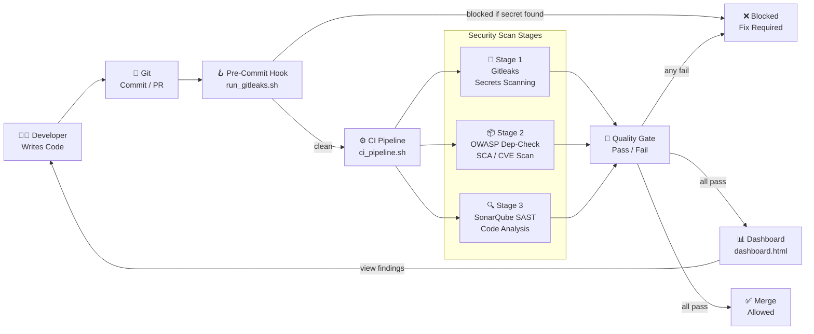

# System Architecture — DevSecOps Code Review Framework

## Overview

This framework implements a **multi-layered code review pipeline** combining three complementary security tools into a single integrated workflow.

```
┌─────────────────────────────────────────────────────────────────────┐
│                    DevSecOps Code Review Framework                  │
└─────────────────────────────────────────────────────────────────────┘
```

---

## Pipeline Architecture



---

## Component Descriptions

### 1. Target Application (`code/`)
- **Type**: PHP web application (login system)
- **Purpose**: Intentionally vulnerable OWASP demo target
- **Key Files**:
  - `DOCTYPE html html head.html` — Login form
  - `php login process php.php` — Backend (SQL injection, XSS, hardcoded password)
  - `sonar-project.properties` — SonarQube scanner config
  - `.gitleaks-project.toml` — Custom secrets scan rules

### 2. Gitleaks (Secrets Scanner)
- **Version**: v8.24.2 (pre-built binary in `gitleaks-bin/`)
- **Source**: `gitleaks/` directory (full Go source also included)
- **Config**: `code/.gitleaks-project.toml` (extends defaults)
- **Output**: `reports/gitleaks/gitleaks_report.json`
- **Standards**: CWE-798, OWASP A07

### 3. OWASP Dependency-Check (SCA)
- **Version**: 12.2.0
- **Binary**: `dependency-check/bin/dependency-check.sh`
- **NVD Cache**: `dependency-check/data/`
- **Output**: `reports/dependency-check/` (HTML + JSON)
- **Standards**: OWASP A06, CWE-1035, CVSS scoring

### 4. SonarQube (SAST Platform)
- **Version**: 26.3.0.120487
- **Server**: `sonarqube-26.3.0.120487/` (embedded H2 database)
- **Scanner**: `sonar-scanner-5.0.1.3006-linux/bin/sonar-scanner`
- **Port**: 9000 (HTTP)
- **Output**: Web dashboard + SonarQube DB
- **Standards**: OWASP Top 10, CWE, SANS Top 25

---

## Directory Structure

```
mp/
├── code/                              ← Target application
│   ├── DOCTYPE html html head.html    ← Login page HTML
│   ├── php login process php.php      ← PHP backend (vulnerable)
│   ├── sonar-project.properties       ← SonarQube project config
│   └── .gitleaks-project.toml         ← Gitleaks custom rules
│
├── scripts/                           ← Automation scripts
│   ├── start_sonarqube.sh             ← Start SonarQube server
│   ├── run_sonar_scan.sh              ← Run SAST scan
│   ├── run_dependency_check.sh        ← Run SCA scan
│   ├── run_gitleaks.sh                ← Run secrets scan
│   ├── ci_pipeline.sh                 ← Master pipeline (all 3 tools)
│   ├── pre-commit-hook.sh             ← Git pre-commit hook
│   └── generate_report.sh             ← Aggregate reports
│
├── docs/
│   ├── ARCHITECTURE.md                ← This file
│   ├── rbac_setup.md                  ← SonarQube RBAC guide
│   ├── performance_tuning.md          ← Performance optimisation
│   ├── remediation/
│   │   ├── sql_injection.md           ← SQL injection fix guide
│   │   ├── xss.md                     ← XSS fix guide
│   │   ├── hardcoded_credentials.md   ← Secrets fix guide
│   │   └── OWASP_SANS_CERT_mapping.md ← Standards mapping table
│   └── reports/
│       └── dashboard.html             ← Security findings dashboard
│
├── reports/                           ← Scan output (generated)
│   ├── gitleaks/gitleaks_report.json
│   ├── dependency-check/
│   └── pipeline_summary.json
│
├── .github/workflows/
│   └── devsecops.yml                  ← GitHub Actions CI pipeline
│
├── gitleaks-bin/gitleaks              ← Gitleaks binary (auto-downloaded)
├── gitleaks/                          ← Gitleaks Go source
├── sonarqube-26.3.0.120487/           ← SonarQube server
├── sonar-scanner-5.0.1.3006-linux/    ← Scanner CLI
├── dependency-check/                  ← OWASP Dep-Check CLI
└── README.md                          ← Getting started guide
```

---

## Service & Port Reference

| Service | Port | URL | Notes |
|---|---|---|---|
| SonarQube Web | 9000 | http://localhost:9000 | Main dashboard |
| SonarQube Elasticsearch | 9001 | Internal only | Do not expose |
| SonarQube Embedded DB (H2) | 9092 | Internal only | Dev/demo only |

---

## Data Flow

```
Developer commits code
        ↓
Gitleaks pre-commit hook scans staged files (Git hook)
        ↓  [if secrets found → block commit]
        ↓  [if clean → allow commit]
        ↓
ci_pipeline.sh triggered
        ↓
  ┌─────────────────────────────────────────────────┐
  │ Stage 1: Gitleaks                               │
  │   reads: code/                                  │
  │   writes: reports/gitleaks/gitleaks_report.json │
  └────────────────────┬────────────────────────────┘
                       │
  ┌────────────────────▼────────────────────────────┐
  │ Stage 2: OWASP Dependency-Check                 │
  │   reads: code/ + NVD database                   │
  │   writes: reports/dependency-check/             │
  └────────────────────┬────────────────────────────┘
                       │
  ┌────────────────────▼────────────────────────────┐
  │ Stage 3: SonarQube Scanner                      │
  │   reads: code/                                  │
  │   sends: analysis to SonarQube server (port 9000)│
  │   writes: SonarQube internal DB                 │
  └────────────────────┬────────────────────────────┘
                       │
  ┌────────────────────▼────────────────────────────┐
  │ generate_report.sh                              │
  │   reads: all JSON reports                       │
  │   writes: reports/pipeline_summary.json         │
  │   updates: docs/reports/dashboard.html (data)   │
  └─────────────────────────────────────────────────┘
```

---

## Security Standards Coverage

| Standard | Tools Implementing It |
|---|---|
| **OWASP Top 10 (2021)** | SonarQube (all categories), Gitleaks (A07), Dep-Check (A06) |
| **SANS CWE Top 25** | SonarQube (CWE tags on each finding) |
| **CERT Secure Coding** | SonarQube (rule descriptions link to CERT) |
| **CVSS Scoring** | OWASP Dep-Check (exact CVSS v2/v3 scores per CVE) |
